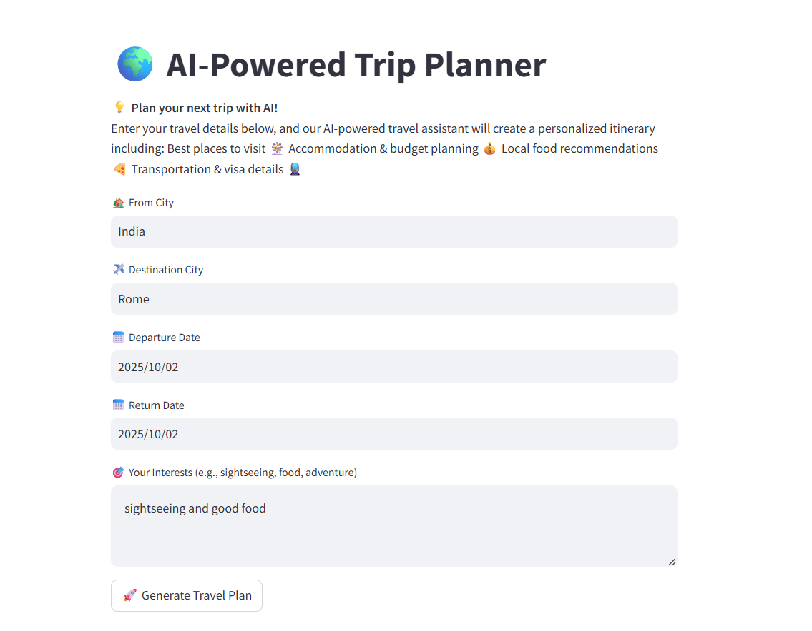
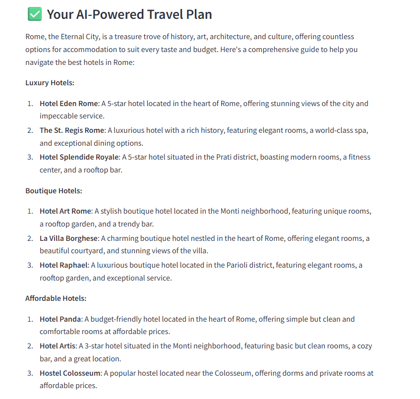
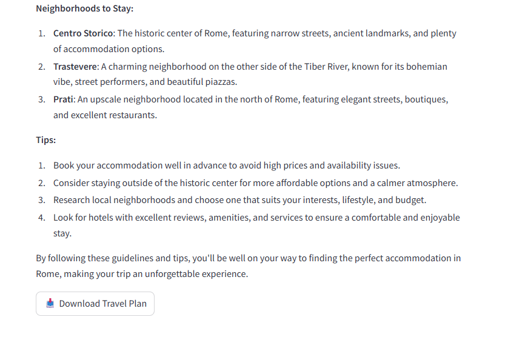

# ✈️ AI-Powered Trip Planner

An intelligent travel planning app built with **CrewAI**, **Streamlit**, and **Ollama LLM**, designed to generate personalized travel itineraries based on user preferences.

---

## 🚀 Features

- 🧠 **AI-Powered Planning**: Multi-agent system (Location, Guide, Planner Experts) for holistic travel insights  
- 🗺️ **Comprehensive Itineraries**: Covers accommodations, transport, food, events, and budgeting  
- 🌐 **Live Web Search**: DuckDuckGo integration for real-time travel data  
- 🖥️ **Streamlit Interface**: Intuitive UI for entering travel details  
- 📄 **Downloadable Plans**: Export itineraries as text files  
- 🌍 **Multi-language Support**: French responses for Francophone destinations  

---

## 🧩 Architecture

Three specialized AI agents collaborate to deliver a complete travel plan:

| Agent            | Role                                                                 |
|------------------|----------------------------------------------------------------------|
| 🏨 Location Expert | Manages logistics: visas, weather, transport, accommodation, costs |
| 🎯 Guide Expert    | Recommends attractions, food, and activities based on interests     |
| 📅 Planner Expert  | Compiles all data into a structured, day-by-day itinerary           |

---

## ⚙️ Installation

### 📋 Prerequisites

- Python 3.8+  
- Ollama installed and running locally  
- Llama 3.2 model pulled via:  
  ```bash
  ollama pull llama3.2

### Setup

- Clone the repo
```
   git clone https://github.com/BrijeshRakhasiya/Trip-Planner-Agent.git
```
-  Install dependencies
```
   pip install -r requirements.txt
```
-  Start Ollama
```
   ollama serve
   ollama pull llama3.2
```
## Usage

1. Run the Streamlit application:
   ```bash
   streamlit run app.py
   ```

2. Open your browser to the provided local URL (typically http://localhost:8501)

3. Fill in the travel details:
   - From City
   - Destination City
   - Departure Date
   - Return Date
   - Interests (e.g., sightseeing, food, adventure)

4. Click "Generate Travel Plan" and wait for the AI to create your personalized itinerary

5. Download the travel plan as a text file

## Dependencies

- `crewai`: Multi-agent AI framework
- `crewai_tools`: Additional tools for CrewAI
- `langchain`: LLM framework integration
- `langchain_community`: Community tools for LangChain
- `langchain-ollama`: Ollama integration for LangChain
- `duckduckgo-search`: Web search functionality
- `langchain-google-genai`: Google Generative AI integration (optional)
- `streamlit`: Web application framework

## Project Structure

```
├── app.py                 # Main Streamlit application
├── TravelAgents.py        # AI agent definitions
├── TravelTasks.py         # Task definitions for agents
├── TravelTools.py         # Custom tools (web search)
├── requirements.txt       # Python dependencies
├── output/                # Generated travel plans
│   └── Travel_Plan_Rome.txt  # Sample output
├── git_assets/            # UI screenshots
│   ├── 1.png
│   ├── 2.png
│   └── 3.png
└── __pycache__/           # Python bytecode cache
```

## Screenshots

### Main Interface


### Travel Plan Generation


### Sample Output


## Sample Output

See `output/Travel_Plan_Rome.txt` for a sample travel plan generated for Rome, focusing on accommodation recommendations.

## Technical Details

- **LLM**: Uses Ollama with Llama 3.2 model running locally
- **Process**: Sequential agent execution for comprehensive planning
- **Tools**: DuckDuckGo web search for real-time information
- **Output Format**: Markdown-structured travel itineraries
- **Language**: Python 3.x with async capabilities

## Configuration

The application uses the following configurations:
- Max iterations per agent: 5
- Verbose logging: Enabled
- Full output: Enabled
- Delegation: Disabled (agents work independently)

## 🧯 Troubleshooting

- Ensure Ollama is running before starting the application
- Check that the Llama 3.2 model is downloaded
- Verify all dependencies are installed
- 🌐 For web search issues, ensure internet connectivity

## 🌟 Future Enhancements

- Support for multiple LLMs
- Integration with booking APIs
- Multi-language interface
- Real-time flight/hotel pricing

## 📄 License

This project is licensed under the MIT License - see the [LICENSE](LICENSE) file for details.

## 🙋‍♂️ Author

**Brijesh Rakhasiya**  
AI/ML Engineer · Data Scientist · Problem Solver

---

**👨‍💻 Developed by Brijesh Rakhasiya**
